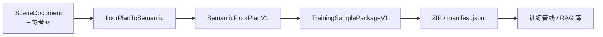

# 3D 场景编辑器 — AI 数据交换格式设计文档

> 版本：v0.1（设计稿）  
> 前置：[户型平面图与 AI 生成 MVP](./3d场景编辑器-户型平面图与AI生成MVP技术文档.md)、[画户型 P1](./3d场景编辑器-画户型P1技术文档)  
> 范围：**导出 / 导入数据格式**、语义化 Schema、转换层、对现有实现的 **影响评估**  
> 不含：在线推理 API、模型训练脚本（另文）

---

## 1. 文档目标

### 1.1 要解决的问题

| 问题 | 说明 |
|------|------|
| 现有 `.json` 场景文件 **不适合直接投喂 AI** | 含随机 UUID、编辑器内部 ID 引用、`assetId` 绑定本地 manifest，模型难以从平面图图像学到稳定映射 |
| 缺少 **语义层** | `Room.name` 为自由文本，无标准房间类型；家具只有 `assetId`，无语义类别（table / chair / ac_unit） |
| 导入 AI 输出时 **不能破坏现有编辑链路** | 画墙、门窗、房间检测、3D 挤出、家具 Command 栈均依赖 `FloorPlan` + `SceneDocument` |
| 数据结构演进需 **可版本化、可回滚** | 训练集、推理结果、编辑器持久化三者格式需解耦 |

### 1.2 设计原则

1. **编辑器运行时真源不变**：`SceneDocument` + `FloorPlan`（`src/types/floorPlan.ts`）仍是唯一编辑态数据结构；AI 格式只在 **边界** 导入/导出。
2. **语义与几何分离**：语义字段（房间类型、OCR 标签、家具类别）放在 **交换层**；几何（墙段、洞口、多边形）可双向换算。
3. **稳定 ID 策略**：AI 格式使用 **数组下标 / 语义键 / 拓扑引用**；进入编辑器时再生成 UUID。
4. **渐进增强**：新增字段一律 **optional**；旧场景文件、IndexedDB 快照无需迁移即可继续工作。
5. **一份样本、多种视图**：同一样本可导出「仅 IR」「IR + 图」「IR + 图 + 完整场景」，供训练 / 评测 / 人工复核不同用途。

---

## 2. 现状审计

### 2.1 现有持久化格式

**场景文件**（`lib/persistence/sceneFile.ts`）：

```json
{
  "format": "3d-scene-editor",
  "formatVersion": 1,
  "exportedAt": 1700000000000,
  "document": {
    "version": 2,
    "id": "uuid",
    "settings": { "name": "...", "gridSize": 0.3, ... },
    "floorPlan": { "walls": {}, "wallIds": [], "rooms": {}, ... },
    "entities": { "uuid": { "type": "model", "assetId": "chair-a", ... } },
    "rootIds": ["uuid"],
    "updatedAt": 1700000000000
  }
}
```

**特点**：

| 维度 | 现状 | AI 友好度 |
|------|------|-----------|
| 墙/门窗 | `Record<id, Entity>` + `wallIds[]` 顺序 | 低（UUID 无意义） |
| 房间 | `wallLoop: string[]` 引用墙 ID | 低（需解图） |
| 房间命名 | `name: string` 自由文本 | 中（无标准枚举） |
| 家具 | `assetId` → 本地 manifest | 低（绑定资源库） |
| 参考户型图 | **尚未纳入** `SceneDocument` | — |
| 校验 | `validateSceneDocument` 校验 entities + manifest | 严格，适合编辑器 |

**IndexedDB**（`lib/persistence/indexedDb.ts`）：直接存 `SceneDocument` 对象，与导出格式一致。

### 2.2 运行时依赖 `FloorPlan` 的模块

以下模块 **直接读取** `document.floorPlan` 的 UUID 引用结构，**不应**改为消费 AI 格式：

| 模块 | 依赖点 |
|------|--------|
| `FloorPlanCanvas.tsx` | `walls[id]`、`openings`、`roomDetection` 结果、`nodes` |
| `WallMeshLayer` / `RoomFloorMeshLayer` | 墙段、房间 `wallLoop` |
| `floorPlanCommands.ts` | 增删改墙/门窗，维护 `nodes` 合并 |
| `roomDetection.ts` | 从墙图遍历面 → 写 `rooms` / `wallLoop` |
| `openingPlacement.ts` | `wallId` + `offset` |
| `FloorPlanSheetCanvas.tsx` | 只读渲染，同 `FloorPlan` |
| `TopViewContent.tsx` | 墙/房间/家具 |
| `PlatformDesignCanvas` | `rooms[roomId].floorMaterial` |
| `sceneStore.updateRoomFloorMaterial` | `rooms[roomId]` |

**结论**：AI 交换格式必须是 **平行层**，通过 **Adapter** 写入 `FloorPlan`，而非替换 `FloorPlan` 类型定义。

---

## 3. 格式分层总览

```
┌──────────────────────────────────────────────────────────────────────┐
│  E3  Editor Scene File          format: 3d-scene-editor              │  ← 现有，用户方案存盘
├──────────────────────────────────────────────────────────────────────┤
│  E2  Semantic Scene Bundle      format: inner3d-semantic-scene/1     │  ← 新增，语义化场景（可选含图）
├──────────────────────────────────────────────────────────────────────┤
│  E1  Semantic Floor Plan        schema: semantic-floor-plan/1        │  ← 新增，AI 主输出/主标签
├──────────────────────────────────────────────────────────────────────┤
│  E0  Training Sample Package    format: inner3d-training-sample/1     │  ← 新增，数据集打包
└──────────────────────────────────────────────────────────────────────┘
                              │
                    Adapter Layer（lib/aiExchange/）
                              │
                              ▼
              SceneDocument.floorPlan + entities（运行时）
```

| 层级 | 用途 | 是否进入编辑器导入 |
|------|------|-------------------|
| E0 | 离线数据集、微调、RAG few-shot | 否（批量工具用） |
| E1 | 模型推理输出、人工标注、Prompt Schema | **是**（经 Adapter） |
| E2 | 带语义的全场景交换、跨项目协作 | **是**（经 Adapter） |
| E3 | 编辑器原生方案 | **是**（现有逻辑） |

---

## 4. E1 — Semantic Floor Plan（语义化户型 IR）

### 4.1 为何不用现有 `FloorPlan` 直接训练

| `FloorPlan` 字段 | 问题 |
|------------------|------|
| `walls[id].startNodeId` | 节点 UUID 对视觉模型无监督信号 |
| `rooms[id].wallLoop` | 墙 ID 环，需先理解墙图 |
| `openings[].wallId` | 间接引用 |
| 无 `roomType` | 无法学习「娱乐室 / 储藏间」等语义 |
| 无 `fixtures` | 平面家具符号不在户型层 |

### 4.2 Schema 定义

**文件扩展名**：`.sfp.json`（Semantic Floor Plan）  
**Schema ID**：`semantic-floor-plan/1`

```typescript
/** 标准房间语义类型（可扩展，模型输出需在枚举内或落 unknown） */
export type RoomType =
  | 'living_room'
  | 'lounge'           // 娱乐室
  | 'bedroom'
  | 'kitchen'
  | 'dining'
  | 'bathroom'
  | 'corridor'         // 过道
  | 'balcony'          // 阳台
  | 'closet'           // 储藏间
  | 'stairwell'        // 楼梯间
  | 'utility'          // 设备间 / 空调机位
  | 'garage'
  | 'office'
  | 'unknown';

/** 平面固定装置 / 家具符号（无语义 assetId） */
export type FixtureCategory =
  | 'table'
  | 'chair'
  | 'sofa'
  | 'bed'
  | 'cabinet'
  | 'storage_rack'
  | 'ac_unit'
  | 'stair'
  | 'sink'
  | 'toilet'
  | 'bathtub'
  | 'appliance'
  | 'unknown';

export interface SemanticFloorPlanV1 {
  schemaVersion: 'semantic-floor-plan/1';

  /** 全局元数据 */
  meta: {
    title?: string;
    floorLevel?: string;          // e.g. "4F", "B1"
    floorLevelLabel?: string;     // e.g. "下三楼"
    source: 'manual' | 'ai' | 'cad_import' | 'editor_export';
    confidence?: number;          // 0~1，AI 输出时使用
    locale?: 'zh-CN' | 'en-US';
    createdAt?: string;           // ISO8601
  };

  /** 物理默认值（米） */
  defaults: {
    wallThickness: number;        // default 0.24
    wallHeight: number;           // default 2.8
    wallKind: 'bearing' | 'nonBearing';
  };

  /** 坐标：世界 XZ 平面，单位米；原点与 editor grid 对齐 */
  coordinateSystem: {
    unit: 'meter';
    /** 图像→世界标定（有参考图时填写） */
    imageCalibration?: {
      imageWidth: number;
      imageHeight: number;
      /** 图像像素 Y 向下；参考线段像素坐标 */
      referenceLinePx: [[number, number], [number, number]];
      referenceLengthM: number;
      rotationRad?: number;
      originWorld?: { x: number; z: number };
    };
  };

  /** 墙段列表 — 用数组下标作拓扑引用 */
  walls: Array<{
    start: { x: number; z: number };
    end: { x: number; z: number };
    thickness?: number;
    height?: number;
    kind?: 'bearing' | 'nonBearing';
    /** 是否外墙（语义，可选） */
    isExterior?: boolean;
  }>;

  /** 门窗洞口 — wallIndex 指向 walls[] */
  openings: Array<{
    type: 'door' | 'window' | 'opening';
    wallIndex: number;
    offset: number;               // 沿墙起点偏移，米
    width: number;
    height?: number;
    sillHeight?: number;
    flip?: boolean;
    /** 语义：入户门 / 推拉门等，P2 */
    doorStyle?: 'swing' | 'sliding' | 'unknown';
  }>;

  /** 房间 — 语义核心 */
  rooms: Array<{
    /** 稳定语义键，用于 fixtures.roomKey 引用；导出时生成 slug */
    key: string;                  // e.g. "lounge", "closet-1"
    roomType: RoomType;
    /** 显示名（可来自 OCR） */
    name?: string;
    nameZh?: string;
    nameEn?: string;
    /** 闭合多边形顶点（米），≥3 点；与墙拓扑 redundant 但利于监督学习 */
    polygon: Array<{ x: number; z: number }>;
    /** 面积（㎡），可冗余存储便于校验 */
    area?: number;
    /** 图中文字标注（OCR 监督） */
    labels?: Array<{
      text: string;
      language?: 'zh' | 'en';
      position: { x: number; z: number };
    }>;
  }>;

  /** 固定装置 / 平面家具符号 */
  fixtures?: Array<{
    category: FixtureCategory;
    roomKey?: string;             // 所属房间语义键
    position: { x: number; z: number };
    rotationDeg?: number;
    size?: { width: number; depth: number; height?: number };
    count?: number;
    label?: string;               // 图中标注，如 "A/C"
  }>;

  /** 无法归入标准类的矢量标注（楼梯箭头、斜墙注释等） */
  annotations?: Array<{
    type: 'text' | 'arrow' | 'dimension' | 'custom';
    content?: string;
    geometry: Array<{ x: number; z: number }>;
  }>;
}
```

### 4.3 语义化设计要点

| 设计点 | 说明 |
|--------|------|
| `roomType` + `nameZh`/`nameEn` | 模型同时学习 **枚举分类** 与 **OCR 文本**；导入编辑器时写入 `Room.name`（优先中文） |
| `rooms[].key` | 跨 fixtures 的稳定引用；导出时由 `roomType + 序号` 生成，如 `balcony-2` |
| `walls[]` 数组 | 墙段顺序与绘制顺序无关；`openings.wallIndex` 显式拓扑 |
| `polygon` 冗余 | 便于 IoU 评测与纯视觉监督；导入时若与墙拓扑不一致，**以墙拓扑为准** 并触发 `detectRooms` |
| `fixtures` 不含 `assetId` | 语义层；映射到 GLTF 在 Adapter 的 `fixtureToEntity` 阶段完成 |

### 4.4 JSON Schema 与 Prompt 投喂

对外发布：

- `schemas/semantic-floor-plan.v1.schema.json` — 机器校验
- `schemas/semantic-floor-plan.v1.prompt.md` — 嵌入系统提示的字段说明 + 枚举表
- `public/ai/examples/` — 2～3 个完整 few-shot 样例（含图一户型示意 IR）

**投喂组合**：

```text
[System] 输出必须符合 semantic-floor-plan/1 JSON Schema …
[User]   <image_url>
[Assistant] { ... SemanticFloorPlanV1 ... }   ← few-shot 示例
[User]   <target_image_url>
```

---

## 5. E0 — Training Sample Package（训练样本包）

### 5.1 单样本结构

**Format ID**：`inner3d-training-sample/1`

```typescript
export interface TrainingSampleMetaV1 {
  id: string;                     // 数据集内唯一，如 "00042"
  split: 'train' | 'val' | 'test';
  quality: 'draft' | 'reviewed';
  source: 'editor_export' | 'manual_trace' | 'cad_import' | 'ai_corrected';
  tags?: string[];                // ["multi_room", "has_balcony", "zh_labels"]
  annotator?: string;
  createdAt: string;
  updatedAt: string;
}

export interface TrainingSamplePackageV1 {
  format: 'inner3d-training-sample';
  formatVersion: 1;
  meta: TrainingSampleMetaV1;

  /** 输入模态 */
  input: {
    image: {
      /** 包内相对路径或 base64（小图） */
      ref: string;
      width: number;
      height: number;
      mimeType: 'image/png' | 'image/jpeg' | 'image/webp';
    };
  };

  /** 主标签（语义 IR） */
  label: SemanticFloorPlanV1;

  /** 可选：编辑器真值，用于 3D 重建误差评测 */
  groundTruth?: {
    floorPlan?: import('@/types/floorPlan').FloorPlan;
    /** 仅评测时用，不含大图 base64 */
    sceneSummary?: {
      entityCount: number;
      roomCount: number;
    };
  };

  /** 可选：模型预测缓存（DPO / 错误分析） */
  prediction?: {
    label: SemanticFloorPlanV1;
    modelId: string;
    predictedAt: string;
  };
}
```

### 5.2 磁盘布局

```
dataset-v1/
├── manifest.jsonl              # 每行 { id, split, imagePath, labelPath, ... }
├── samples/
│   ├── 00001/
│   │   ├── sample.json         # TrainingSamplePackageV1
│   │   ├── image.png
│   │   └── label.json          # 可选拆分：仅 SemanticFloorPlanV1
│   └── 00002/
│       └── ...
└── schemas/
    └── semantic-floor-plan.v1.schema.json
```

### 5.3 从编辑器导出的工作流



**触发入口（规划）**：TopBar → 导出 ▾ → 「AI 训练样本包 (.zip)」

---

## 6. E2 — Semantic Scene Bundle（语义化场景包）

用于 **跨编辑器交换** 或 **AI 生成后带家具草稿** 导入，比 E1 多 `furniture` 语义层。

```typescript
export interface SemanticFurnitureV1 {
  key: string;
  category: FixtureCategory;
  /** 映射建议，非强制 */
  suggestedAssetId?: string;
  name?: string;
  roomKey?: string;
  transform: {
    position: { x: number; y: number; z: number };
    rotationY: number;
    scale?: { x: number; y: number; z: number };
  };
}

export interface SemanticSceneBundleV1 {
  format: 'inner3d-semantic-scene';
  formatVersion: 1;
  exportedAt: string;
  floorPlan: SemanticFloorPlanV1;
  furniture?: SemanticFurnitureV1[];
  sceneSettings?: {
    name?: string;
    gridSize?: number;
  };
  /** 可选参考图 */
  referenceImage?: {
    ref: string;
    mimeType: string;
    width: number;
    height: number;
  };
}
```

**与 E3 的关系**：E2 导入 → Adapter → 完整 `SceneDocument`；E3 导出 → 可选「另存为语义场景包」。

---

## 7. Adapter 转换层设计

### 7.1 模块规划

```
src/lib/aiExchange/
├── types/
│   ├── semanticFloorPlan.ts      # E1 类型 + 枚举
│   ├── trainingSample.ts         # E0 类型
│   └── semanticSceneBundle.ts    # E2 类型
├── validate/
│   ├── validateSemanticFloorPlan.ts
│   └── validateTrainingSample.ts
├── convert/
│   ├── floorPlanToSemantic.ts    # FloorPlan → E1（导出）
│   ├── semanticToFloorPlan.ts      # E1 → FloorPlan（导入）
│   ├── entitiesToFixtures.ts       # SceneEntity → fixtures
│   ├── fixturesToEntities.ts       # fixtures → SceneEntity 草稿
│   └── semanticSceneToDocument.ts  # E2 → SceneDocument
├── export/
│   ├── exportTrainingSample.ts
│   └── exportSemanticScene.ts
├── import/
│   ├── importSemanticFloorPlan.ts
│   └── importSemanticScene.ts
└── taxonomy/
    ├── roomTypeLabels.ts           # roomType ↔ 中英文默认名
    └── fixtureAssetMap.ts          # FixtureCategory → 默认 assetId
```

### 7.2 `floorPlanToSemantic`（导出）

| 步骤 | 逻辑 |
|------|------|
| 1 | 遍历 `wallIds`，按序输出 `walls[]`（记录 `wallId → index` 映射） |
| 2 | 遍历 `openingIds`，`wallId` 转 `wallIndex` |
| 3 | 遍历 `roomIds`，从 `getRoomFloorPolygon` 得 `polygon`；`roomType` 从 **新增可选字段** `Room.roomType` 或启发式推断 |
| 4 | 遍历 `rootIds` entities，`assetId` 反查 `FixtureCategory` |
| 5 | 填充 `meta.source = 'editor_export'` |

**不修改** 原 `FloorPlan` 对象。

### 7.3 `semanticToFloorPlan`（导入）

| 步骤 | 逻辑 | 复用现有 |
|------|------|----------|
| 1 | Schema 校验 + 默认值填充 | `validateSemanticFloorPlan` |
| 2 | 墙段 snap / ortho 可选 | `snap.ts`、`applyOrtho` |
| 3 | 创建 nodes + walls + UUID | `mutations.ts`、`createWallSegment` |
| 4 | 创建 openings | `createOpeningOnWall` |
| 5 | 房间：优先跑 `detectRooms`；再按 `roomType`/`name` **匹配** 合并语义 | `roomDetection.ts` |
| 6 | 冲突策略：墙拓扑 > 房间 polygon | 见 §7.4 |

**导入必须走 Command**（`ReplaceFloorPlanCommand` 或等价），保证可撤销。

### 7.4 冲突与校验策略

| 冲突 | 处理 |
|------|------|
| `openings.wallIndex` 越界 | 拒绝导入，报错 |
| 墙过短（< 0.1m） | 丢弃并 warning |
| 房间 polygon 与 detectRooms 结果 IoU < 0.5 | 采用 detectRooms，保留 AI `roomType` 按最近 centroid 匹配 |
| 未知 `roomType` | 映射为 `unknown`，`name` 仍写入 |
| 未知 `FixtureCategory` | 跳过或导入为占位 box（P2） |
| 重复 `rooms[].key` | 导入前自动 suffix `-2` |

---

## 8. 对现有数据结构的影响评估

### 8.1 推荐：最小侵入式扩展

**仅对 `FloorPlan` / `SceneDocument` 做 optional 扩展**，不改动现有字段语义：

```typescript
// types/floorPlan.ts — 建议新增（optional）
export type RoomType = import('@/lib/aiExchange/types/semanticFloorPlan').RoomType;

export interface Room {
  // ...existing
  roomType?: RoomType;   // 新增，optional
}

// types/scene.ts — 建议新增（optional）
export interface FloorPlanReference {
  imageRef: string;       // IndexedDB key 或相对路径
  mimeType: string;
  width: number;
  height: number;
  transform?: { scale: number; offsetX: number; offsetZ: number; rotationRad: number };
}

export interface SceneDocument {
  // ...existing
  floorPlanReference?: FloorPlanReference;  // 参考户型图
}
```

**不修改** `version: 2` 的含义；`normalizeSceneDocument` 对缺失字段补 `undefined`。

### 8.2 模块级影响矩阵

| 模块 / 文件 | 若只加 Adapter（不改 FloorPlan） | 若扩展 Room.roomType + floorPlanReference |
|-------------|----------------------------------|-------------------------------------------|
| `sceneFile.ts` | **无影响**；新增独立 `semanticFile.ts` | 需扩展 `validateSceneDocument` 透传 optional 字段；**向后兼容** |
| `documentUtils.ts` | 无影响 | `normalizeSceneDocument` 忽略未知 roomType |
| `indexedDb.ts` | 无影响 | 自动持久化新字段 |
| `floorPlanCommands.ts` | 无影响 | 可选：`SetRoomTypeCommand` |
| `roomDetection.ts` | 无影响 | 检测后保留已有 `roomType` |
| `FloorPlanCanvas.tsx` | 无影响 | 可选：房间标签显示 `roomType` |
| `FloorPlanPropertyPanel.tsx` | 无影响 | 可选：房间类型下拉 |
| `FloorPlanSheetCanvas.tsx` | 无影响 | 可选：优先显示语义名 |
| `WallMeshLayer` / 3D 挤出 | **无影响** | 无影响 |
| `SceneEntity` / 家具逻辑 | 无影响 | 无影响 |
| `TopBar` 导入导出 | 新增菜单项与文件类型 | 参考图随 E3 导出需 **大图外置** 策略 |
| `historyStore` / Command | 新增 `ImportSemanticFloorPlanCommand` | 同左 |

### 8.3 高风险变更（本设计 **明确不做**）

| 变更 | 风险 |
|------|------|
| 用 `walls[]` 数组 **替换** `walls: Record<id>` | 破坏全部 floorPlan 命令与选择逻辑，**全量重写** |
| 让 AI 直接输出 `SceneDocument` | UUID 不稳定、无法训练；导入校验与 manifest 强耦合 |
| 在 `FloorPlan` 内嵌 `fixtures[]` | 与 `entities` 双源，家具同步复杂度指数上升 |
| 修改 `Vec2` 为 `{x,y}` 像素坐标 | 2D/3D 全链路坐标系崩溃 |
| bump `SceneDocument.version` 至 3 并强制迁移 | 旧 JSON / IndexedDB 需迁移脚本 |

### 8.4 导入 AI 数据后的运行时行为

```
用户选择 import.sfp.json
  → validateSemanticFloorPlan
  → semanticToFloorPlan → FloorPlan
  → ImportSemanticFloorPlanCommand（historyStore）
  → sceneStore.document.floorPlan 更新
  → roomDetection 若 autoRoom（已有逻辑）
  → WallMeshLayer / FloorPlanSheetCanvas 自动刷新（React 订阅）
  → fixtures? → fixturesToEntities 草稿（可选，不自动 Command）
```

**现有逻辑零改动路径**：只要 `semanticToFloorPlan` 输出合法 `FloorPlan`，下游渲染与编辑 **无需感知** 数据来源。

---

## 9. 导出 / 导入 API 规划

### 9.1 导出

| API | 输入 | 输出 |
|-----|------|------|
| `exportSemanticFloorPlan(doc)` | `SceneDocument` | `SemanticFloorPlanV1` JSON |
| `exportSemanticSceneBundle(doc, opts?)` | + 参考图 | `.ssb.json` 或 ZIP |
| `exportTrainingSample(doc, imageFile, meta)` | + split/quality | ZIP（E0 布局） |
| `downloadSceneFile(doc)` | — | **保持现有 E3** |

### 9.2 导入

| API | 输入 | 行为 |
|-----|------|------|
| `readSceneFile(file)` | `.json` E3 | **不变** |
| `readSemanticFloorPlan(file)` | `.sfp.json` | 校验 → 预览 → Command 写入 |
| `readSemanticSceneBundle(file)` | `.ssb.json` / ZIP | 同上 + 可选家具 |
| `readTrainingSample(file)` | 样本包 | 仅数据集工具 / 调试，**不直接进编辑器** |

### 9.3 UI 入口（规划）

| 位置 | 动作 |
|------|------|
| TopBar → 导出 ▾ | 场景 JSON（现有）/ 语义户型 JSON / AI 训练样本包 |
| TopBar → 导入 ▾ | 场景 JSON（现有）/ 语义户型 JSON |
| 画户型面板 | 「从 AI 结果导入」→ 文件选择 → 预览 diff → 确认 |
| 户型平面图面板 | 「导出当前语义数据」（开发调试） |

---

## 10. 版本与兼容策略

| 标识 | 演进规则 |
|------|----------|
| `semantic-floor-plan/1` → `/2` | 仅增字段；Adapter 同时支持 v1/v2 读入，写出最新版 |
| `inner3d-training-sample/1` | 样本 meta 记录 `label.schemaVersion` |
| `SceneDocument.version` 2 | 保持；optional 字段扩展不 bump |
| `3d-scene-editor` formatVersion 1 | 保持；referenceImage 用 sidecar 文件 |

**旧文件**：无 `roomType`、无 `floorPlanReference` → 行为与今天完全一致。

---

## 11. 资产语义映射表（初版）

AI `FixtureCategory` → 编辑器 `assetId`（`fixturesToEntities` 默认映射，可配置）：

| FixtureCategory | 默认 assetId | 备注 |
|-----------------|--------------|------|
| `chair` | `chair-a` | |
| `table` | `table-medium` | |
| `sofa` | `couch` | |
| `bed` | `bed-double-a` | |
| `cabinet` | `cabinet-medium` | |
| `storage_rack` | `cabinet-medium` | 暂代 |
| `ac_unit` | — | P2：占位几何或自定义 GLTF |
| `unknown` | — | 跳过，仅保留语义记录 |

| RoomType | 默认 nameZh |
|----------|-------------|
| `lounge` | 娱乐室 |
| `corridor` | 过道 |
| `balcony` | 阳台 |
| `closet` | 储藏间 |
| `stairwell` | 楼梯间 |

---

## 12. 实现阶段建议

| 阶段 | 交付 | 对现有代码改动 |
|------|------|----------------|
| **D1** | `types` + JSON Schema + 样例 JSON | 无 |
| **D2** | `floorPlanToSemantic` + 单元测试 | 无 |
| **D3** | `semanticToFloorPlan` + `ImportSemanticFloorPlanCommand` | 新增 Command；**不改** FloorPlan 结构 |
| **D4** | TopBar 导出/导入 `.sfp.json` | TopBar + 新 `semanticFile.ts` |
| **D5** | `Room.roomType` optional + 属性面板 | 小改 `types/floorPlan.ts`、PropertyPanel |
| **D6** | E0 训练样本 ZIP + `floorPlanReference` | 扩展 SceneDocument optional；IndexedDB 大图策略 |
| **D7** | `fixturesToEntities` + E2 场景包 | 新增 mapping 配置 |

---

## 13. 验收标准

1. 从现有画好的户型 **导出** `SemanticFloorPlanV1`，JSON 含 `roomType`、墙数组、门窗 `wallIndex`、fixtures。
2. 将导出 JSON **再导入** 同一编辑器，墙体/房间/门窗与导出前 **拓扑一致**（允许 UUID 不同）。
3. 现有 `.json` 场景文件导入导出 **行为不变**。
4. IndexedDB 自动保存 **不受** 新 optional 字段影响。
5. 无效 AI JSON（越界 wallIndex、非多边形 room）→ **明确错误**，不 partially corrupt 文档。
6. 提供至少 **1 份** 基于图一结构的 `examples/lounge-sample.sfp.json` 夹具。

---

## 14. 相关文档

| 文档 | 关系 |
|------|------|
| [户型平面图与 AI 生成 MVP](./3d场景编辑器-户型平面图与AI生成MVP技术文档.md) | UI 与 IR 概念前身；本文档将 IR 正式命名为 **SemanticFloorPlanV1** 并补全交换细节 |
| [画户型 P1](./3d场景编辑器-画户型P1技术文档) | `FloorPlan` 编辑真源 |
| `src/types/floorPlan.ts` | L2 运行时模型 |
| `src/lib/persistence/sceneFile.ts` | E3 现有导入导出 |

---

## 15. 附录 A — 图一户型 SemanticFloorPlanV1 片段（示意）

```json
{
  "schemaVersion": "semantic-floor-plan/1",
  "meta": {
    "title": "四层娱乐层",
    "floorLevelLabel": "下三楼",
    "source": "manual",
    "locale": "zh-CN"
  },
  "defaults": { "wallThickness": 0.24, "wallHeight": 2.8, "wallKind": "nonBearing" },
  "coordinateSystem": { "unit": "meter" },
  "walls": [],
  "openings": [],
  "rooms": [
    {
      "key": "lounge",
      "roomType": "lounge",
      "nameZh": "娱乐室",
      "nameEn": "LOUNGE",
      "polygon": []
    },
    {
      "key": "corridor",
      "roomType": "corridor",
      "nameZh": "过道",
      "polygon": []
    },
    {
      "key": "balcony-left",
      "roomType": "balcony",
      "nameZh": "阳台",
      "polygon": []
    },
    {
      "key": "balcony-right",
      "roomType": "balcony",
      "nameZh": "阳台",
      "polygon": []
    },
    {
      "key": "closet",
      "roomType": "closet",
      "nameEn": "CLOSET",
      "nameZh": "储藏间",
      "polygon": []
    }
  ],
  "fixtures": [
    { "category": "table", "roomKey": "lounge", "position": { "x": 0, "z": 0 }, "size": { "width": 1.2, "depth": 1.2 } },
    { "category": "chair", "roomKey": "lounge", "count": 4, "position": { "x": 0, "z": 0 } },
    { "category": "cabinet", "roomKey": "lounge", "position": { "x": 0, "z": 0 } },
    { "category": "storage_rack", "roomKey": "closet", "position": { "x": 0, "z": 0 } },
    { "category": "ac_unit", "roomKey": "balcony-right", "label": "A/C", "position": { "x": 0, "z": 0 } }
  ],
  "annotations": [
    {
      "type": "arrow",
      "content": "下三楼",
      "geometry": [{ "x": 0, "z": 0 }, { "x": 0, "z": -1 }]
    }
  ]
}
```

> 完整坐标需在实际 tracing 后由 `floorPlanToSemantic` 自动生成；此片段仅用于 Schema 与 Prompt few-shot。

## 16. 附录 B — 与旧 MVP 文档 IR 命名对照

| 旧 MVP 文档 | 本文档 |
|-------------|--------|
| `FloorPlanIR v1` | **`SemanticFloorPlanV1`**（`schemaVersion: semantic-floor-plan/1`） |
| `FloorPlanTrainingSampleV1` | **`TrainingSamplePackageV1`**（`format: inner3d-training-sample`） |
| `FloorPlanReference` | 不变，并入 `SceneDocument` optional |

命名统一后，实现代码目录建议使用 `aiExchange`，避免与运行时 `floorPlan` 混淆。
