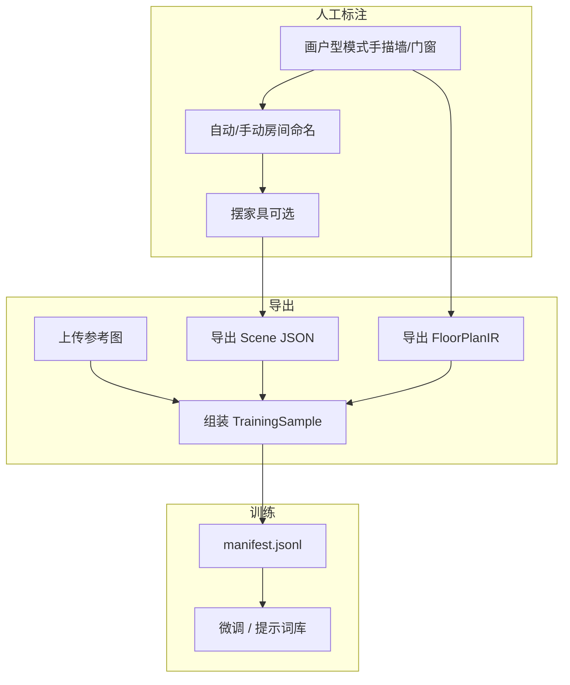

# 3D 场景编辑器 — 户型平面图展示 & AI 户型→JSON MVP 技术文档

> 版本：v0.1（MVP 设计）  
> 前置：已完成 [P0](./3d场景编辑器mvp技术文档)、[P1 画户型](./3d场景编辑器-画户型P1技术文档)、[地台设计](./3d场景编辑器-地台设计MVP技术文档)  
> 参考：用户提供的平面户型图样例（娱乐室 / 过道 / 阳台 / 储藏间 / 楼梯等）  
> 技术栈延续：React + Vite + TypeScript + R3F + Zustand + IndexedDB

---

## 1. 项目概述

### 1.1 背景与目标

当前 **摆家具模式** 右侧仅有「2D 视图」（R3F 正交俯视图，同步墙体与家具）和属性面板。产品下一阶段需要：

1. **产品可见性**：在 2D 视图 **下方** 增加一块 **户型平面图** 区域，呈现接近 CAD/效果图的平面样式（对标用户图一），让用户在摆家具时始终能看到「整套房型」上下文。
2. **AI 能力预埋**：后续通过大模型，从 **扫描/拍摄的平面户型图** 自动生成编辑器可消费的 **`FloorPlan` JSON**（并可扩展家具语义层），再驱动现有 3D 管线挤出墙体、识别房间、放置家具。

本 MVP 文档定义 **界面布局、数据分层、AI 投喂格式、训练样本规范、推理链路**，以及分阶段交付边界。实现时优先 **复用现有 `FloorPlan` 类型与 SVG 渲染能力**，避免平行维护两套几何数据。

### 1.2 与现有系统的关系

| 已有能力 | 本 MVP 如何利用 |
|----------|----------------|
| `SceneDocument.floorPlan`（`src/types/floorPlan.ts`） | AI 与平面图面板的 **唯一几何真源** |
| `FloorPlanCanvas` + `RoomFloorFills2D` 等 SVG 组件 | 平面图面板 **复用同一套 2D 绘制逻辑**（只读、不同视觉样式） |
| `TopView` + `TopViewContent`（R3F） | 保持现状；与平面图 **共享 `floorPlan` 数据**，视图独立 |
| `sceneFile.ts` 导入导出 | 扩展 **AI 训练包** 导出格式 |
| `FloorPlanToolPanel`「导入 CAD/JPG 即将推出」 | 本 MVP 在摆家具侧栏先落地 **参考图上传 + 预览**，AI 解析为 P2 |

### 1.3 MVP 功能边界

| 功能 | MVP | 说明 |
|------|-----|------|
| 摆家具模式右侧：2D 视图下方增加「户型平面图」面板 | ✅ | 布局 + 只读渲染 |
| 从当前 `floorPlan` 自动生成 CAD 风格平面图 | ✅ | SVG，墙体/房间/门窗/家具符号 |
| 与 2D 顶视 **联动缩放/平移**（可选） | ⚪ | MVP 默认 **独立视图**；P1.5 可加「同步视图」开关 |
| 上传参考户型图（JPG/PNG）并叠显/对照 | ✅ | 存 data URL 或 IndexedDB blob |
| 房间名称、面积标注 | ✅ | 来自 `Room.name` / `Room.area` |
| 图例、比例尺、指北针 | ⚪ | P2 |
| 大模型在线推理「图→JSON」 | ❌ | P2；MVP 只定协议 + 假数据/demo 按钮 |
| 自动校正参考图比例/旋转 | ❌ | P2 |
| 从平面图一键覆盖当前 `floorPlan` | ❌ | P2；需确认弹窗 + Command |
| 家具从平面图 AI 识别并自动摆放 | ❌ | P3；先输出 `FloorPlanFurnitureDraft` |

---

## 2. 产品交互设计

### 2.1 摆家具模式 — 右侧栏布局（目标态）

在 `EditorLayout` 摆家具分支中，将 `editor__right` 由「上 2D + 下属性」调整为 **三段**：

```
┌──────────────────────────────┐
│ 2D视图          (现有 TopView) │  ← R3F 正交，家具+墙，可点选家具
│ height: 160px (可配置)         │
├──────────────────────────────┤
│ 户型平面图      (新增)         │  ← SVG 只读，CAD 风格
│ height: 200px (MVP 默认)       │
├──────────────────────────────┤
│ 属性面板        (现有)         │  flex: 1
└──────────────────────────────┘
```

**对标用户图一的视觉要素（MVP 尽量覆盖）**：

| 图一元素 | MVP 平面图表现 |
|----------|----------------|
| 粗灰外墙/内墙 | `WallMesh` 对应 quad 描边 + 填充 `#e2e8f0` |
| 房间浅灰填充 | `RoomFloorFills2D` 样式变体（更浅、无选中高亮） |
| 房间中英文标签 | `Room.name` 居中；无名称时显示「房间 n」 |
| 门扇弧线 / 窗 | 复用 `OpeningSymbol2D` |
| 桌椅等家具 | 复用 `ModelSymbol2D`（俯视图轮廓） |
| 楼梯、空调等特殊符号 | P2：`FloorPlanAnnotation` 扩展层 |
| 参考扫描图 | 作为 **底图** 半透明显示（有上传时） |

**交互（MVP 只读）**：

| 操作 | 行为 |
|------|------|
| 滚轮 | 缩放平面图 |
| 右键拖拽 | 平移 |
| 双击 | fit 到 `floorPlan` 包围盒 |
| 左键点击房间/墙/家具 | MVP **不选中**（避免与 TopView 冲突）；P2 可同步 `floorPlanSelection` |
| 点击「AI 生成」 | MVP：toast「即将推出」或打开 demo JSON 预览 |

**空状态**：

- 无 `floorPlan` 或无任何墙：显示占位文案「请先在画户型模式中绘制墙体」+ 跳转画户型按钮。
- 有墙无房间：仍显示墙；提示「墙体未闭合，房间将自动检测」。

### 2.2 与画户型模式的分工

| 模式 | 中间主区 | 右侧上部 | 右侧中部 |
|------|----------|----------|----------|
| 画户型 | `FloorPlanCanvas`（可编辑 SVG） | 3D 预览 | — |
| 摆家具 | `SceneViewport` | `TopView`（R3F） | **`FloorPlanSheetPanel`（新增，只读 SVG）** |

画户型模式 **不** 重复显示该面板（中央已是全功能 2D 画布）。避免双编辑器竞争指针事件。

### 2.3 参考户型图上传（MVP 数据入口）

为后续 AI 做准备，MVP 支持在平面图面板工具栏：

1. **上传参考图**：`accept="image/jpeg,image/png,image/webp"`，最大边 4096px，单张 ≤ 8MB。
2. **显示模式**：`off` | `underlay`（默认 40% 透明度垫底）| `side-by-side`（P2）。
3. **存储**：写入 `SceneDocument` 新字段（见 §4），随方案 JSON 导出；大图可走 IndexedDB 引用（P1.5）。

> 图一这类扫描/截图是 AI 训练的 **输入模态**；编辑器内手绘的 `floorPlan` 是 **监督标签（ground truth）**。

---

## 3. AI 链路总览（MVP 定协议，P2 实现推理）

### 3.1 端到端流程


**原则**：

- 模型 **不直接** 输出 Three.js 场景，只输出 **结构化 JSON**。
- 后处理尽量复用 `lib/floorPlan/roomDetection.ts`、`snap.ts`、`mutations.ts`，保证与手动画户型一致。
- 人工可在画户型模式中修正，再导出为 **训练样本** 反哺模型。

### 3.2 模型选型建议（实现阶段参考，MVP 不绑定）

| 阶段 | 方案 | 说明 |
|------|------|------|
| 冷启动 | 多模态大模型 + JSON Schema 约束输出 | GPT-4o / Claude / 国产 VL；few-shot 提示词 |
| 规模化 | 微调专用小模型（LayoutLMv3、UDOP、或自训 ViT+Transformer decoder） | 输入图像 patch，输出 token 序列 = JSON |
| 生产 | 本地 ONNX / 服务端 batch | 延迟与成本可控 |

MVP 阶段在仓库内提供 **`/public/ai/demo-floor-plan-ir.json`** 与 **「加载 Demo」** 按钮，验证 `IR → FloorPlan` 转换器即可。

---

## 4. 数据模型设计

### 4.1 分层架构（投喂 AI 的核心）

建议将数据分为 **三层**，训练与推理只暴露必要层，避免模型学习编辑器内部 ID 不稳定问题。

```
┌─────────────────────────────────────────────────────────┐
│ L3  SceneDocument          编辑器持久化（含 entities）   │
├─────────────────────────────────────────────────────────┤
│ L2  FloorPlan              几何真源（墙/门窗/房间）       │  ← 现有 types/floorPlan.ts
├─────────────────────────────────────────────────────────┤
│ L1  FloorPlanIR v1         AI 友好中间表示（语义+拓扑）    │  ← 新增，训练主标签可选
├─────────────────────────────────────────────────────────┤
│ L0  RasterImage + metadata 原始户型图 + 标定信息          │
└─────────────────────────────────────────────────────────┘
```

### 4.2 L2 — 现有 `FloorPlan`（几何真源，保持不变）

继续使用 `src/types/floorPlan.ts`：

- 坐标：**世界 XZ 平面，单位米**，`Vec2 { x, z }`。
- 实体：`walls`、`openings`、`rooms`、`nodes`。
- 房间闭合后由 `roomDetection` 写入 `wallLoop`、`area`、`centroid`。

**AI 合并策略（P2 实现）**：

```typescript
// 伪代码：推理结果写入文档
function applyFloorPlanIR(ir: FloorPlanIR, doc: SceneDocument): SceneDocument {
  const fp = irToFloorPlan(ir, doc.floorPlan?.settings ?? defaultSettings);
  return { ...doc, floorPlan: fp, updatedAt: Date.now() };
}
```

### 4.3 L1 — `FloorPlanIR v1`（推荐给大模型的输出格式）

IR 比 `FloorPlan` 更适合视觉模型学习：

- 用 **拓扑**（墙段索引、节点坐标）而非 UUID；
- 房间用 **多边形顶点** 或 **墙段环** 表达；
- 语义字段明确（`roomType`、`labels`）；
- 家具用 **符号 + 归一化 bbox**，不绑定 `assetId`。

```typescript
/** AI 中间表示 — 版本化，用于训练/推理 */
export interface FloorPlanIRv1 {
  schemaVersion: 'floor-plan-ir/1';
  /** 图像像素 ↔ 世界米 的标定；无标定时仅输出归一化坐标 */
  calibration?: {
    /** 图像上已知长度线段的两端像素坐标 */
    referenceLinePx: [{ x: number; y: number }, { x: number; y: number }];
    lengthMeters: number;
    /** 图像 Y 轴向下 → 世界 Z 轴的旋转（弧度），默认 0 */
    rotationRad?: number;
    originWorld?: { x: number; z: number };
  };
  meta?: {
    floorName?: string;
    source?: 'ai' | 'manual' | 'import';
    confidence?: number;
  };
  walls: Array<{
    start: { x: number; z: number };
    end: { x: number; z: number };
    thickness?: number;
    height?: number;
    kind?: 'bearing' | 'nonBearing';
  }>;
  openings: Array<{
    type: 'door' | 'window' | 'opening';
    /** 所在墙段索引（walls 数组下标） */
    wallIndex: number;
    /** 沿墙起点偏移，米 */
    offset: number;
    width: number;
    height?: number;
    sillHeight?: number;
  }>;
  rooms: Array<{
    name?: string;
    nameZh?: string;
    roomType?: string; // lounge | corridor | balcony | closet | stairwell | ...
    /** 闭合多边形顶点（米） */
    polygon: Array<{ x: number; z: number }>;
    labels?: Array<{ text: string; position: { x: number; z: number } }>;
  }>;
  /** 平面家具符号（可选，P3 自动摆家具） */
  fixtures?: Array<{
    category: string; // table | chair | cabinet | ac_unit | storage_rack | ...
    position: { x: number; z: number };
    rotationDeg?: number;
    size?: { width: number; depth: number };
    count?: number;
  }>;
}
```

**转换关系**：

| IR 字段 | → `FloorPlan` |
|---------|----------------|
| `walls[]` | `createWallSegment` + `nodes` 去重合并 |
| `openings[].wallIndex` | 解析为 `wallId` + `offset` |
| `rooms[].polygon` | 匹配 `wallLoop` 或触发 `detectRooms` |
| `fixtures[]` | 不写入 `FloorPlan`；转 `SceneEntity` 草稿列表 |

### 4.4 L0 — 训练样本包 `FloorPlanTrainingSample v1`

用于 **离线训练 / 微调 / RAG few-shot**，一条样本 = 一张图 + 标签 JSON + 可选编辑器全量文档。

```typescript
export interface FloorPlanTrainingSampleV1 {
  id: string;
  /** 相对数据集根路径，如 images/00042.png */
  imagePath: string;
  imageSize: { width: number; height: number };
  /** 人工或编辑器导出的 IR（推荐主标签） */
  floorPlanIR: FloorPlanIRv1;
  /** 可选：完整 FloorPlan，用于评测 3D 重建误差 */
  floorPlan?: import('@/types/floorPlan').FloorPlan;
  /** 可选：完整场景，用于家具监督 */
  sceneDocument?: import('@/types/scene').SceneDocument;
  annotations: {
    /** 数据集划分 */
    split: 'train' | 'val' | 'test';
    /** 标注者 / 来源 */
    source: 'manual_trace' | 'editor_export' | 'cad_import';
    quality: 'draft' | 'reviewed';
    tags?: string[];
  };
}
```

**目录结构示例**：

```
datasets/floor-plan-v1/
  manifest.jsonl          # 每行一个 FloorPlanTrainingSampleV1
  images/
    00001.png
    00002.png
  ir/
    00001.json
    00002.json
  scenes/                 # 可选
    00001.scene.json
```

### 4.5 `SceneDocument` 扩展（MVP 新增字段）

```typescript
export interface FloorPlanReference {
  /** 参考图：data URL 或 IndexedDB key */
  imageRef: string;
  mimeType: string;
  width: number;
  height: number;
  /** 与 floorPlan 对齐的变换（像素→世界） */
  transform?: {
    scale: number;
    offsetX: number;
    offsetZ: number;
    rotationRad: number;
  };
  displayMode: 'off' | 'underlay';
}

// SceneDocument 增加可选字段：
// floorPlanReference?: FloorPlanReference;
// lastAiInference?: { ir: FloorPlanIRv1; at: number };
```

版本迁移：`documentUtils.normalizeSceneDocument` 缺省补 `undefined`，`version` 仍为 `2`（或 bump 到 `3` 时一并迁移）。

---

## 5. 大模型投喂与训练策略

### 5.1 投喂什么给模型？

| 投喂内容 | 用途 | 格式 |
|----------|------|------|
| **图像** | 输入 | PNG/JPG，建议短边 ≥ 1024，保持长宽比 |
| **系统提示 + JSON Schema** | 约束输出 | `FloorPlanIRv1` 的 TypeScript 类型转 JSON Schema |
| **1～3 条 few-shot** | 冷启动提高结构正确率 | `(image_url, ir_json)` 对 |
| **负例/修正对** | DPO/RLHF（P3） | 模型输出 vs 人工修正后的 IR |

**不建议** 直接把完整 `SceneDocument`（含 UUID、entities）作为训练标签：ID 随机、体积大、与图像不对齐。

### 5.2 训练样本如何产生？（与编辑器工作流绑定）



**推荐主路径（质量最高）**：

1. 在编辑器中 **按图一 tracing** 画墙 → 得到精确 `FloorPlan`（L2）。
2. 从 `FloorPlan` **自动反向生成** `FloorPlanIR`（`floorPlanToIR()`，确定性算法）。
3. 将用户上传的 **同一张参考图** 与 IR 绑定为训练对。
4. （可选）用 CV 工具从参考图生成 **弱标签** 预标注，人工在画户型模式修正。

**数据量建议（经验值）**：

| 阶段 | 样本量 | 目标 |
|------|--------|------|
| Few-shot 提示 | 5～20 张 | 演示可用 |
| 微调 MVP | 200～500 张 | 简单户型可用 |
| 生产 | 2000+ 张 | 多户型、标注 reviewed |

### 5.3 Prompt 模板（推理阶段示例）

```text
你是建筑平面图的数字化助手。根据输入的平面户型图，输出符合 JSON Schema 的 FloorPlanIR v1。
要求：
- 坐标单位：米；原点取户型左下角或图像左下角经标定后的世界原点。
- 墙厚默认 0.24m，层高默认 2.8m，除非图中标注。
- 识别门（弧线/缺口）、窗（双线）、房间名称（中英文）。
- 只输出 JSON，不要 markdown 代码块。

JSON Schema:
{ ... FloorPlanIRv1 JSON Schema ... }

示例 1:
[image]
{ ... few-shot ir ... }
```

**后处理校验清单**（自动，不进入编辑器前执行）：

- 墙段长度 > 0.1m，角度 snap 0°/90°（可配置）
- 开口 `offset + width` ≤ 墙长
- 房间多边形闭合、面积 > 1㎡
- Schema 校验（`ajv` 或 zod）

### 5.4 评测指标

| 指标 | 计算方式 |
|------|----------|
| 墙端点误差 | IR 墙端点 vs 人工 `FloorPlan` 平均距离（m） |
| 房间 IoU | 房间多边形交集/并集 |
| 开口 F1 | 门/窗中心点匹配阈值 0.3m |
| 3D 可视化通过率 | 导入编辑器无报错 + 房间数一致 |

---

## 6. 技术实现方案（MVP 编码）

### 6.1 新增组件与模块

| 路径 | 职责 |
|------|------|
| `src/app/layout/FloorPlanSheetPanel.tsx` | 右栏「户型平面图」容器：header + 工具栏 + SVG |
| `src/features/floorPlan/FloorPlanSheetCanvas.tsx` | 只读 SVG；复用 `canvasView`、`RoomFloorFills2D`、`OpeningSymbol2D`、`ModelSymbol2D` |
| `src/features/floorPlan/floorPlanSheetStyle.ts` | CAD 视觉 token（墙色、标注字体） |
| `src/lib/floorPlan/floorPlanIR.ts` | `floorPlanToIR` / `irToFloorPlan` / schema 校验 |
| `src/lib/floorPlan/exportTrainingSample.ts` | 从 `SceneDocument` 生成 `FloorPlanTrainingSampleV1` |
| `src/types/floorPlanIR.ts` | IR 与 TrainingSample 类型 |

### 6.2 布局改动

**`EditorLayout.tsx`**（摆家具分支）：

```tsx
<aside className="editor__right">
  <TopView />
  <FloorPlanSheetPanel />   {/* 新增 */}
  <PropertyPanel />
</aside>
```

**`src/styles/variables.less`**：

```less
@height-top-view: 160px;
@height-floor-plan-sheet: 200px;  // 新增
```

**`src/styles/index.less`**：`.floor-plan-sheet` 与 `.top-view` 类似，`flex-shrink: 0`，底部分割线。

### 6.3 视图状态

- 平面图面板使用 **独立** `CanvasViewState`（存 `editorStore.floorPlanSheetView`），避免与画户型 `floorPlanZoom/Pan`、TopView 相机互相污染。
- 进入摆家具模式时：若有墙，执行 `fitViewToFloorPlanBounds(floorPlan)`。

### 6.4 导出菜单（TopBar 扩展，MVP 可选）

| 菜单项 | 输出 |
|--------|------|
| 导出场景 JSON | 现有 |
| 导出 AI 训练包 | `zip`: `image.png` + `ir.json` + `scene.json` + `meta.json` |
| 复制 IR 到剪贴板 | 开发调试 |

### 6.5 依赖

- MVP **不新增** npm 包；Schema 校验可用轻量手写或后续加 `zod`。
- 压缩包导出可用 `fflate`（若已有则复用，否则 MVP 仅下载 JSON）。

---

## 7. 样例：图一户型 → IR 片段（示意）

> 以下为 **示意性** IR，坐标需按实际 tracing 标定；用于 few-shot 与单测夹具。

```json
{
  "schemaVersion": "floor-plan-ir/1",
  "meta": { "floorName": "四层娱乐层", "source": "manual" },
  "rooms": [
    { "name": "LOUNGE", "nameZh": "娱乐室", "roomType": "lounge", "polygon": [] },
    { "nameZh": "过道", "roomType": "corridor", "polygon": [] },
    { "nameZh": "阳台", "roomType": "balcony", "polygon": [] },
    { "name": "CLOSET", "nameZh": "储藏间", "roomType": "closet", "polygon": [] }
  ],
  "fixtures": [
    { "category": "table", "position": { "x": 0, "z": 0 }, "size": { "width": 1.2, "depth": 1.2 } },
    { "category": "chair", "count": 4, "position": { "x": 0, "z": 0 } },
    { "category": "ac_unit", "position": { "x": 0, "z": 0 } }
  ],
  "walls": [],
  "openings": []
}
```

单测：`irToFloorPlan(sampleIR)` → `roomIds.length >= 1` 且墙数 > 0（完整夹具另存 `fixtures/ir/lounge-sample.json`）。

---

## 8. 分阶段交付计划

| 阶段 | 交付物 | 工期（估） |
|------|--------|------------|
| **MVP-A** | `FloorPlanSheetPanel` + 只读 SVG + 布局样式 | 2～3 天 |
| **MVP-B** | `floorPlanReference` 上传与底图叠显 | 1～2 天 |
| **MVP-C** | `FloorPlanIR` 类型 + `floorPlanToIR` / `irToFloorPlan` + 单测 | 2～3 天 |
| **MVP-D** | 导出训练包 + Demo IR 加载按钮 | 1～2 天 |
| **P2** | 后端/云端 VL 推理 API + 应用 IR 到文档（Command） | 1～2 周 |
| **P3** | `fixtures` → 家具草稿 + 资产库映射 | 1 周+ |

---

## 9. 风险与对策

| 风险 | 对策 |
|------|------|
| 扫描图倾斜/比例不准 | IR 带 `calibration`；MVP 支持参考图手动缩放平移 |
| 模型输出 JSON 非法 | Schema 校验 + 默认墙厚/层高 + 失败回退仅导入墙 |
| 双 2D 视图行为不一致 | 平面图只读；编辑统一在画户型模式 |
| 训练数据 ID 泄露/过拟合 | 导出 IR 时剥离 UUID；增强：旋转/镜像图像 |
| 大图 base64 膨胀方案 JSON | 参考图走 IndexedDB；导出训练包用侧车文件 |

---

## 10. 验收标准（MVP-A～D）

1. 摆家具模式下，右侧 **2D 视图下方** 可见「户型平面图」面板，高度约 200px，可滚轮缩放、右键平移。
2. 有手绘 `floorPlan` 时，平面图显示墙体、房间填充、门窗符号、家具俯视图轮廓，风格接近 CAD 平面图。
3. 可上传参考 JPG/PNG，以半透明垫底显示；刷新后仍可加载（IndexedDB 或 document 字段）。
4. 可从当前场景导出 `FloorPlanTrainingSampleV1`（含 `image` + `ir` + 可选 `floorPlan`）。
5. `irToFloorPlan` 对 Demo IR 可生成合法 `FloorPlan`，3D 预览墙体能正常挤出。
6. 文档、类型、导出函数有单测覆盖核心转换。

---

## 11. 相关文档与代码索引

| 文档 / 代码 | 说明 |
|-------------|------|
| [画户型 P1](./3d场景编辑器-画户型P1技术文档) | `FloorPlanCanvas`、墙体与房间 |
| `src/types/floorPlan.ts` | L2 几何模型 |
| `src/app/layout/EditorLayout.tsx` | 右栏编排入口 |
| `src/app/layout/TopView.tsx` | 现有 2D 顶视 |
| `src/lib/floorPlan/roomDetection.ts` | IR 合并后房间检测 |
| `src/lib/persistence/sceneFile.ts` | 场景 JSON 校验 |

---

## 12. 附录：README 文档表更新项

落地后在 `README.md`「相关文档」增加一行：

| 文档 | 内容 |
|------|------|
| [3d场景编辑器-户型平面图与AI生成MVP技术文档](./3d场景编辑器-户型平面图与AI生成MVP技术文档.md) | 平面图面板、FloorPlanIR、AI 训练样本与推理链路 |
